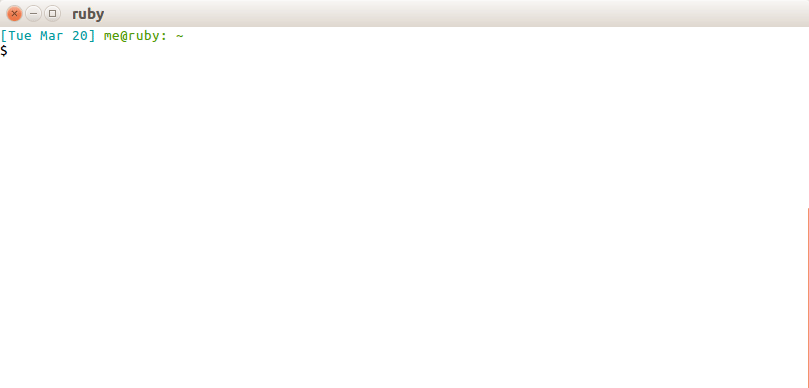

matrix.py
=========

One day I learned [curses](https://docs.python.org/3/library/curses.html) and wrote a little
[digital rain](https://en.wikipedia.org/wiki/Matrix_digital_rain) script.

Then I had the idea to make it show bases of DNA, as many [others](https://linux.die.net/man/1/xmatrix)
have done.

Then I thought it'd be cool to make it show *real* DNA from sequencing files. Especially when
real-time sequencers like [Oxford Nanopore](https://en.wikipedia.org/wiki/Oxford_Nanopore_Technologies)
now give output as it's generated. So you can see your reads coming in *live*, in the coolest way
90's cyberpunks could imagine!

Usage
-----

Just point it to a FASTA file with `-a` or a FASTQ file with `-q`. Or, give the path to a directory
of FASTA or FASTQ files. Then it'll start showing each file, starting with the newest. If a new file
appears, it'll immediately start reading that one. So you can point this to the directory your
sequencer is depositing FASTQ's into, and it'll automatically show the newest sequence that's arrived.

Unfortunately, the colors don't show correctly in the default OS X terminal. It shows up as white
text on black (not very Matrix-y). If you'd really like to get it looking better, here's a workaround:  
Go to Terminal > Preferences > Profiles  
\- You might want to create a new profile for this.  
Then, select whichever profile you want to use and change these values under the "Text" tab:  
\- Change the Background "Color & Effects" to black.  
\- Change the color for "Text" to green.  
\- Uncheck "Display ANSI colors".  
Then start a new terminal with that profile.  
